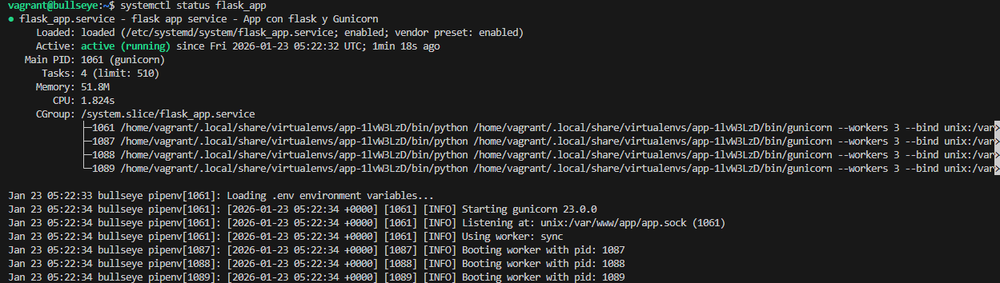
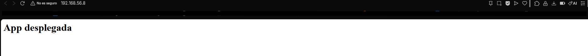

# Práctica: Despliegue de Aplicaciones Python con Flask, Gunicorn y Nginx

> Mario Luna López 2ºDAW_B

**Repositorio:** *[github.com/mlunlop-iezv/python-con-flask-y-gunicorn](https://github.com/mlunlop-iezv/python-con-flask-y-gunicorn)*

---

## 1. Introducción

En esta práctica vamos a configurar un entorno de producción profesional para aplicaciones **Python**. A diferencia de los servidores tradicionales, en Python utilizaremos la arquitectura estándar WSGI, empleando:
* **Flask:** Micro-framework para el desarrollo de la aplicación.
* **Gunicorn:** Servidor de aplicaciones WSGI que ejecutará el código Python.
* **Nginx:** Servidor web que actuará como **Proxy Inverso** y servirá los archivos estáticos.
* **Pipenv:** Para la gestión moderna de entornos virtuales y dependencias.

* ### Configuración del Vagrantfile

Hemos actualizado el `Vagrantfile` para adaptar la máquina virtual al nuevo entorno. Mantenemos la IP estática **192.168.56.8** para facilitar el acceso, pero hemos añadido redirección de puertos para pruebas:
* Puerto 80 (Guest) -> 8080 (Host): Para acceso vía Nginx.
* Puerto 5000 (Guest) -> 5000 (Host): Para pruebas directas contra Gunicorn.

## 2. Instalación del Entorno

* ### Automatización en bootstrap.sh

Para cumplir con el requisito de **despliegue automatizado**, he reescrito el script de aprovisionamiento (`bootstrap.sh`). Ahora se encarga de instalar Python3, Pip, Nginx y configurar los permisos necesarios en `/var/www/app`.

```bash
# Fragmento del script de automatización
echo "Instalando dependencias de Python y Nginx..."
apt-get install -y python3-pip python3-dev nginx git
pip3 install pipenv python-dotenv

# Configuración de permisos para el usuario vagrant y el grupo www-data
chown -R vagrant:www-data /var/www/app
chmod -R 775 /var/www/app
```

### Verificación del Servicio

Tras ejecutar vagrant up, el script configura automáticamente Systemd. Comprobamos que el servicio de nuestra aplicación (flask_app.service) está activo y corriendo:

```bash
systemctl status flask_app
```



3. Configuración del Servidor de Aplicaciones (Gunicorn)
En lugar de ejecutar Python manualmente, hemos creado un servicio de sistema. El script genera dinámicamente el archivo /etc/systemd/system/flask_app.service.

Lo más destacado es el uso de un Socket Unix (app.sock) para comunicarse con Nginx, lo cual es más seguro y rápido que usar puertos TCP abiertos.

```ini
[Service]
User=vagrant
Group=www-data
WorkingDirectory=/var/www/app
Environment="PATH=/usr/local/bin"
# Ejecución mediante Pipenv apuntando al socket
ExecStart=/usr/local/bin/pipenv run gunicorn --workers 3 --bind unix:/var/www/app/app.sock wsgi:app
```

## 4. Configuración del Proxy Inverso (Nginx)

Nginx se ha configurado para escuchar en el puerto 80 e interceptar las peticiones al dominio app.izv.

### Bloque de Servidor (Nginx)

El archivo de configuración /etc/nginx/sites-available/app.conf redirige el tráfico hacia el socket creado por Gunicorn:

```bash
server {
    listen 80;
    server_name app.izv www.app.izv 192.168.56.8;

    location / {
        include proxy_params;
        proxy_pass http://unix:/var/www/app/app.sock;
    }
}
```

### Comprobación de funcionamiento

Tras configurar el archivo hosts en la máquina anfitriona (192.168.56.8 app.izv), accedemos al navegador para ver la Prueba de Concepto (PoC):



## 5. Tarea de Ampliación: Azure Repository

Para completar la práctica, sustituimos la aplicación básica por un proyecto real alojado en GitHub (Microsoft Azure Samples).

### Pasos realizados manualmente en la máquina:

 1. Limpiamos el directorio de la app y clonamos el repositorio.

 2. Instalamos las dependencias del requirements.txt.

```bash
# Ir a la carpeta de webs
cd /var/www

# Borrar la app básica actual
sudo rm -rf app

# Clonar el repositorio de Azure
sudo git clone https://github.com/Azure-Samples/msdocs-python-flask-webapp-quickstart app

# Ajustar permisos para que tu usuario pueda instalar cosas
sudo chown -R vagrant:www-data app

# Entrar en la carpeta
cd app

# Instalar las dependencias del nuevo proyecto
pipenv install -r requirements.txt

# Reiniciar el servicio para que cargue la nueva web
sudo systemctl restart flask_app
```

Resultado final con la aplicación externa funcionando:

