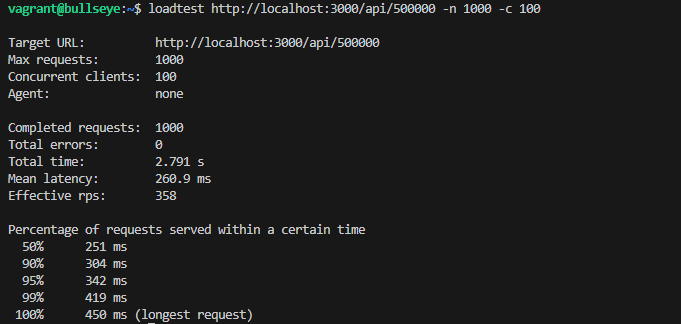
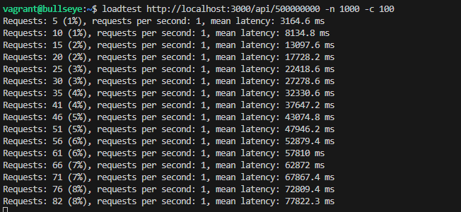
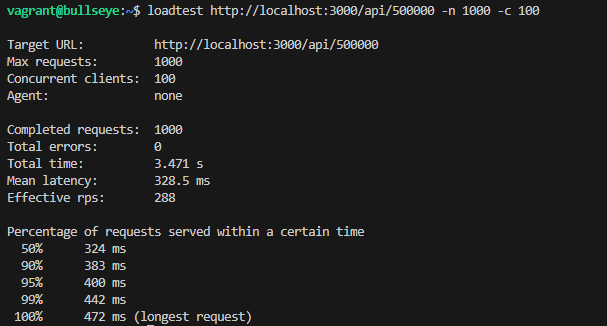
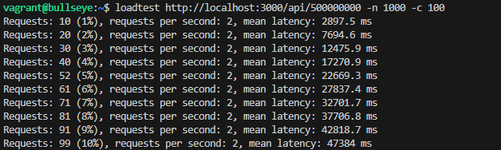

# Práctica: Despliegue de Aplicaciones en "Cluster" con NodeJS y Express

> Mario Luna López 2ºDAW_B

**Repositorio:** *[github.com/mlunlop-iezv/cluster-con-nodejs-y-express](https://github.com/mlunlop-iezv/cluster-con-nodejs-y-express)*

---

## 1. Introducción y Preparación del Entorno

El objetivo principal es abordar una de las características fundamentales de Node.js: su arquitectura Single-Threaded (un solo hilo). Por defecto, una instancia de Node.js se ejecuta en un solo núcleo de la CPU. En servidores modernos multinúcleo, esto supone un desperdicio de recursos y un cuello de botella, ya que una tarea pesada puede bloquear el servidor para todos los usuarios.

Para solucionar esto, implementaremos técnicas de Clustering (agrupación de procesos) para distribuir la carga de trabajo entre todos los núcleos disponibles

* ### Adaptación de la Infraestructura como Código

  Para automatizar el despliegue de este nuevo stack tecnológico, he modificado los archivos de configuración de Vagrant respecto a la práctica anterior.

  * ###  A. Modificación del Vagrantfile
    La aplicación Express que vamos a desarrollar escucha por defecto en el puerto 3000. Hemos actualizado la configuración de red de la máquina virtual para exponer este puerto en lugar del 5000 (Flask).

    ```bash
     # Redirección de puertos para Node.js
     config.vm.network "forwarded_port", guest: 3000, host: 3000
    ```

  * ### B. Reescritura del bootstrap.sh

    El script de aprovisionamiento ha sido reescrito totalmente.

    Las herramientas clave instaladas son:

    * Node.js (v18.x LTS): Entorno de ejecución para JavaScript en el servidor.
    * PM2 (Process Manager 2): Un gestor de procesos de producción que utilizaremos en la segunda parte de la práctica. PM2 incluye un balanceador de carga integrado que nos permitirá gestionar el clúster automáticamente sin modificar el código de la aplicación.
    * Loadtest: Herramienta para realizar pruebas de estrés y carga HTTP. La usaremos para medir la latencia y las peticiones por segundo (RPS) y comparar el rendimiento "Con Cluster" vs "Sin Cluster".

    ```bash
    # Fragmento del nuevo bootstrap.sh
    echo "Instalando herramientas globales de Node..."
    # pm2: Para gestión de clusters en producción
    # loadtest: Para pruebas de estrés
    npm install -g pm2 loadtest express-generator
    ```

    Además, el script prepara automáticamente el directorio /var/www/node_app, asignando los permisos al usuario vagrant e inicializando un proyecto npm básico si no existe, para que al entrar por SSH todo esté listo para trabajar.

---

## 2. Pruebas de Rendimiento: Aplicación Monohilo (Sin Cluster)

Antes de implementar la solución, debemos visualizar el problema. Node.js utiliza un único hilo de ejecución (Single Thread). Si este hilo se ocupa con una tarea intensiva de CPU, el servidor dejará de responder a otras peticiones hasta que termine.

### 2.1. Código de la aplicación (`no-cluster.js`)

Hemos creado una aplicación express sencilla que simula una tarea pesada.

* **Ruta `/`**: Responde inmediatamente ("Hello World").
* **Ruta `/api/:n`**: Realiza un bucle de sumas `n` veces. Si `n` es muy alto (ej. 5.000.000.000), simula una operación de bloqueo[cite: 67, 68].

```javascript
const express = require("express");
const app = express();
const port = 3000;
const limit = 5000000000;

app.get("/", (req, res) => {
  res.send("Hello World!");
});

app.get("/api/:n", function (req, res) {
  let n = parseInt(req.params.n);
  let count = 0;
  if (n > limit) n = limit;
  
  // Simulación de tarea intensiva 
  for (let i = 0; i <= n; i++) {
    count += i;
  }
  res.send(`Final count is ${count}`);
});

app.listen(port, () => {
  console.log(`App listening on port ${port}`);
});
```

### 2.2. Despliegue y Ejecución

* #### 1. Iniciamos el proyecto e instalamos Express dentro de la máquina virtual:

  ```bash
   npm init -y
  ```
* #### 2. Ejecutamos la aplicación 

  ```bash
  node no-cluster.js
  ```

  

## 2.3. Comprobación del Bloqueo (Problemática)

Para demostrar el problema del hilo único, realizamos la siguiente prueba manual:

* #### 1. Abrimos una pestaña en el navegador con una carga pesada: http://192.168.56.8:3000/api/5000000000.

* #### 2. Inmediatamente, abrimos una segunda pestaña con una carga ligera: http://192.168.56.8:3000/.

* #### 3. Resultado: La segunda pestaña, que debería ser instantánea, se queda "cargando" hasta que la primera termina.

Esto ocurre porque el único núcleo de la CPU está ocupado al 100% resolviendo el bucle de la primera petición.


---

## 3. Métricas de Rendimiento

Para ver la diferencia real de rendimiento, vamos a usar `loadtest`. Esta herramienta nos permite simular que hay muchos usuarios intentando entrar a la vez en nuestra web.

Ya la tenemos instalada en la máquina porque la incluimos en el script de inicio (`npm install -g loadtest`).

### 3.1. Pruebas sin Cluster (Monohilo)

Primero probamos la aplicación básica (`no-cluster.js`) que solo usa un núcleo del procesador. 

1. Arrancamos la aplicación en una terminal:
   ```bash
   node no-cluster.js
   ```

2. Desde otra terminal, lanzamos los ataques de prueba.

#### Prueba A: Carga Ligera

Hacemos 1000 peticiones con 100 usuarios simultáneos a la ruta rápida (/api/500000).

```bash
loadtest http://localhost:3000/api/500000 -n 1000 -c 100
```



   Como se ve en la captura, al ser una tarea fácil, el servidor responde muy rápido y aguanta muchas peticiones por segundo.

#### Prueba B: Carga Pesada

Ahora hacemos lo mismo, pero a la ruta difícil (/api/5000000000) que bloquea el procesador.

```bash
loadtest http://localhost:3000/api/500000000 -n 1000 -c 100
```



   El rendimiento cae en picado. Como solo tenemos un hilo, se queda bloqueado calculando las sumas y hace esperar a todos los demás. Las peticiones por segundo bajan casi a 0.

### 3.2. Implementación del Cluster (with-cluster.js)

Para arreglar esto, creamos el archivo with-cluster.js usando el módulo cluster de Node.js.

Lo que hace este script es sencillo:

1. El proceso Maestro mira cuántos núcleos tiene la CPU.

2. Crea un proceso hijo (Worker) para cada núcleo.

3. Si un Worker falla, el Maestro levanta otro automáticamente.

Este es el código que he usado:

```javascript
const express = require("express");
const port = 3000;
const limit = 5000000000;
const cluster = require("cluster");
const totalCPUs = require("os").cpus().length;

if (cluster.isMaster) {
  console.log(`Número de CPUs: ${totalCPUs}`);
  console.log(`Maestro ${process.pid} en marcha`);

  for (let i = 0; i < totalCPUs; i++) {
    cluster.fork();
  }

  cluster.on("exit", (worker, code, signal) => {
    console.log(`El worker ${worker.process.pid} ha muerto`);
    cluster.fork();
  });

} else {
  const app = express();
  console.log(`Worker ${process.pid} iniciado`);

  app.get("/", (req, res) => {
    res.send("Hello World!");
  });

  app.get("/api/:n", function (req, res) {
    let n = parseInt(req.params.n);
    let count = 0;
    if (n > limit) n = limit;

    for (let i = 0; i <= n; i++) {
      count += i;
    }
    res.send(`Final count is ${count}`);
  });

  app.listen(port, () => {
    console.log(`App escuchando en puerto ${port}`);
  });
}
```

### 3.3. Pruebas con Cluster

Ejecutamos la nueva app y vemos cómo arrancan varios workers a la vez (uno por núcleo):

```bash
node with-cluster.js
```


Repetimos las mismas pruebas de antes para comparar:

#### Prueba A: Carga ligera (Con Cluster)

Hacemos 1000 peticiones con 100 usuarios simultáneos a la ruta rápida (/api/500000) pero esta vez con cluster.

```bash
loadtest http://localhost:3000/api/500000 -n 1000 -c 100
```



   Como se ve en la captura, al ser una tarea fácil, el servidor responde muy rápido y aguanta muchas peticiones por segundo.

#### Prueba B: Carga Pesada

```bash
loadtest http://localhost:3000/api/500000000 -n 1000 -c 100
```



### 3.4. Conclusión

La diferencia es clara. Al usar el Cluster, la carga se reparte entre los núcleos. Mientras uno está ocupado sumando, los otros siguen libres para atender peticiones. Hemos conseguido bajar muchísimo el tiempo de espera y aumentar las peticiones que el servidor puede aguantar.